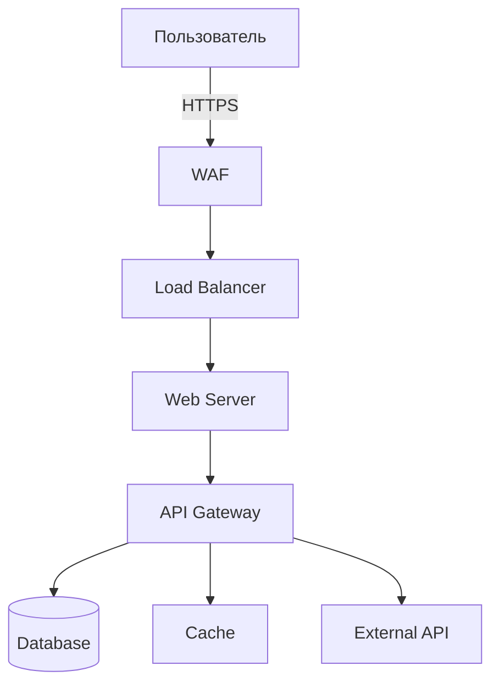

# Практическое моделирование угроз

## Введение

Моделирование угроз (Threat Modeling) — это систематический подход к идентификации, оценке и приоритизации угроз безопасности для системы.

## Методологии

```markdown
## Популярные методологии

| Метод | Описание | Лучшее применение |
|-------|----------|-------------------|
| STRIDE | 6 категорий угроз | Дизайн систем |
| PASTA | 7-этапный процесс | Complex systems |
| TRAM | Угрозы для API | Web services |
| VAST | Визуальное моделирование | Agile команды |
| NIST | Структурированный подход | Enterprise |
```

## Применение STRIDE

```python
STRIDE_MAPPING = {
    'Spoofing': [
        'Аутентификация пользователя',
        'Сертификаты и ключи',
        'Session management'
    ],
    'Tampering': [
        'Валидация ввода',
        'Целостность данных',
        'Защита конфигурации'
    ],
    'Repudiation': [
        'Логирование',
        'Non-repudiation',
        'Аудит действий'
    ],
    'Information Disclosure': [
        'Шифрование данных',
        'Access control',
        'Data classification'
    ],
    'Denial of Service': [
        'Rate limiting',
        'Redundancy',
        'Load balancing'
    ],
    'Elevation of Privilege': [
        'Authorization',
        'Privilege separation',
        'Input validation'
    ]
}
```

## Практический пример

```markdown
## Моделирование для Web Application

### Diagram
```
[User] --> HTTPS --> [Load Balancer] --> [Web Server] --> [API] --> [Database]
```

### Assets
- User credentials
- Session tokens
- PII data
- Business logic

### Trust Boundaries
- Internet -> Load Balancer
- Load Balancer -> Web Server
- Web Server -> Database

### Threats (STRIDE)
1. S: Credential stuffing attacks
2. T: SQL injection in API
3. R: User denies action
4. I: Session token exposure
5. D: DDoS on login endpoint
6. E: Privilege escalation via API
```

## DFD для моделирования



## Mitigation Strategies

```yaml
# Threat register
threats:
  - id: T001
    threat: SQL Injection
    stride: T
    likelihood: medium
    impact: critical
    mitigations:
      - Parameterized queries
      - ORM usage
      - WAF rules
      - Input validation
    status: mitigated
    
  - id: T002
    threat: Session Hijacking
    stride: I
    likelihood: high
    impact: high
    mitigations:
      - Secure cookies (HttpOnly, Secure)
      - Session timeout
      - IP binding
    status: mitigated
```

## Инструменты

```bash
# Microsoft Threat Modeling Tool
threatmodelingtool

# OWASP Threat Dragon
owasp-threat-dragon

# IriusRisk
# Enterprise инструмент

# Pytm
pytm --model mymodel.yaml --report
```

## Best Practices

1. Моделировать на ранних этапах дизайна
2. Пересматривать при изменениях
3. Вовлекать разработчиков
4. Использовать team-based подход
5. Документировать решения
6. Связывать с тестированием

